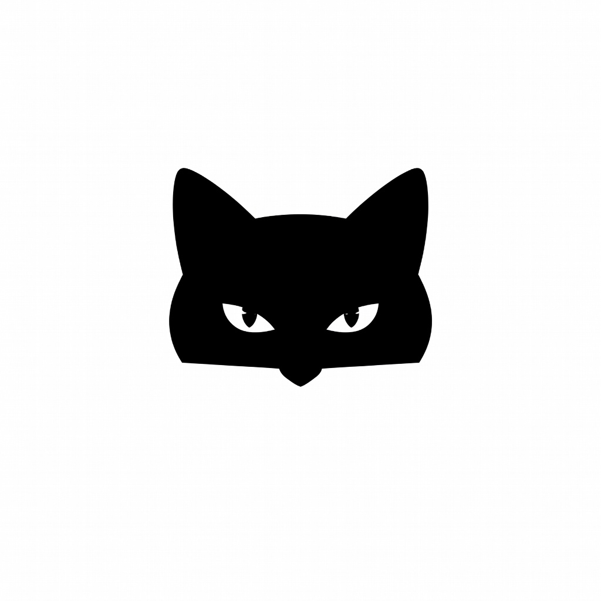

<div align="center">
  
  <h1>Grok Sandbox</h1>
  <p><strong>Public wrapper repository for verified Grok CLI experiments.</strong><br />Bilingual docs, a portable Telegram helper, and a pinned snapshot of the Sunwood Grok CLI fork.</p>
</div>

<p align="center">
  <a href="https://github.com/Sunwood-ai-labs/grok-cli-sandbox/actions/workflows/ci.yml"></a>
  <a href="https://github.com/Sunwood-ai-labs/grok-cli-sandbox/actions/workflows/docs-pages.yml"></a>
  <a href="./LICENSE"></a>
</p>

<p align="center">
  <a href="./README.md">English</a>
  ·
  <a href="./README.ja.md">日本語</a>
  ·
  <a href="https://sunwood-ai-labs.github.io/grok-cli-sandbox/">Docs</a>
</p>

<p align="center">
  
</p>

## ✨ What This Repo Is

`grok-cli-sandbox` is the public-facing wrapper repository around a tested Grok CLI workspace.

- The actual CLI source lives in the [`./grok-cli`](./grok-cli) submodule.
- This root repository adds curated docs, verification notes, helper glue, and brand assets.
- The included snapshot is pinned to a published branch in [`Sunwood-ai-labs/grok-cli`](https://github.com/Sunwood-ai-labs/grok-cli/tree/codex/sandbox-snapshot-20260324) so fresh clones remain reproducible.

This repository is intentionally scoped as a reproducible sandbox and documentation surface, not as the canonical upstream for the CLI itself.

## 🚀 Quick Start

1. Clone the repository with submodules.

   ```powershell
   git clone --recurse-submodules https://github.com/Sunwood-ai-labs/grok-cli-sandbox
   cd grok-cli-sandbox
   ```

2. Configure your xAI settings in `~/.grok/user-settings.json`.

   ```json
   {
     "baseURL": "https://api.x.ai/v1",
     "defaultModel": "grok-code-fast-1",
     "apiKey": "<your xAI API key>"
   }
   ```

3. Use the pinned CLI snapshot from the submodule.

   ```powershell
   cd .\grok-cli
   grok --help
   grok models
   grok -p "Reply with only pong." --format json
   ```

4. Build the docs site locally when you want the published experience.

   ```powershell
   cd ..\docs
   npm install
   npm run assets:build
   npm run docs:build
   ```

## 🧪 Verified Surface

The curated verification pages cover one Windows sandbox session dated **2026-03-24**.

- Headless prompt execution with JSON event output
- Session continuation with `--session latest`
- Tool families such as `search_web`, `search_x`, `task`, `delegate`, and `delegation_read`
- Image generation and archived media output
- Telegram remote-control pairing and helper-driven file operations

These are documented as dated observations, not evergreen guarantees for every future CLI build.

## Command Highlights From the Raw Log

`GROK_COMMANDS_AND_OUTPUTS.md` is now reflected in the curated docs as a command-oriented summary.

- Environment capture: `bun --version` -> `1.3.11`, `node --version` -> `v24.12.0`, `grok --version` -> `1.0.0-rc5`
- Local verification: `bun install`, `bun run build`, `bun run typecheck`, and `bunx vitest run src/grok/client.test.ts` completed successfully with 11 tests passing
- Headless flow: `grok -p "Reply with only pong." --format json` emitted `step_start` / `text` / `step_finish`, and `--session latest` correctly recalled `NEBULA-47`
- Tooling: the raw log includes `search_web`, `task`, `delegate`, `delegation_read`, and `search_x` examples with captured JSON tool events
- Media and Telegram: the archive records `generate_image`, `generate_video`, helper startup, pairing approval, chat roundtrips, file edits, and Telegram-specific test coverage

For the curated version of those command results, see [Command Highlights](./docs/command-highlights.md).

## 📚 Read Next

- [Docs site](https://sunwood-ai-labs.github.io/grok-cli-sandbox/)
- [Getting Started](./docs/getting-started.md)
- [Repository Layout](./docs/repo-structure.md)
- [Verification Summary](./docs/verification-summary.md)
- [Command Highlights](./docs/command-highlights.md)
- [Telegram Helper Guide](./docs/telegram-helper.md)
- [Evidence & Archive Notes](./docs/evidence.md)
- [Archived Raw Session Log](./GROK_COMMANDS_AND_OUTPUTS.md)

## 🧩 Repository Layout

| Path | Purpose |
| --- | --- |
| [`grok-cli`](./grok-cli) | Pinned CLI source snapshot from `Sunwood-ai-labs/grok-cli` |
| [`docs`](./docs) | Bilingual VitePress docs and repository guides |
| [`assets`](./assets) | Sample media plus reusable repo identity assets |
| [`telegram-remote-bridge.mjs`](./telegram-remote-bridge.mjs) | Portable helper for Telegram remote control |
| [`GROK_COMMANDS_AND_OUTPUTS.md`](./GROK_COMMANDS_AND_OUTPUTS.md) | Archived raw notebook from the original sandbox run |

## 🤖 Telegram Helper

The helper in [`telegram-remote-bridge.mjs`](./telegram-remote-bridge.mjs) now resolves paths from the current checkout instead of hardcoding one local workspace.

```powershell
bun .\telegram-remote-bridge.mjs
```

Optional overrides are available if you want to move the log or pairing files:

- `GROK_SANDBOX_ROOT`
- `GROK_SANDBOX_REPO_DIR`
- `GROK_SANDBOX_LOG_PATH`
- `GROK_SANDBOX_PAIR_PATH`

The full guide lives in [docs/telegram-helper.md](./docs/telegram-helper.md).

## 🔐 Secrets & Privacy

- Repo-local `.grok/`, `.env*`, pairing files, and helper logs are git-ignored.
- Curated docs intentionally avoid publishing live bot tokens, user IDs, or local database paths.
- Local runtime artifacts remain local-only and are described in [docs/evidence.md](./docs/evidence.md) as unpublished evidence.

## 🖼️ Example Output

Generated sample image preserved from the verified session:



## ⚠️ Scope Notes

- This repo documents a tested sandbox snapshot. It does not replace the upstream CLI repository.
- The `node dist/index.js` caveat documented in the guides was observed on Node `v24.12.0` during the 2026-03-24 verification session.
- The archived raw session log is intentionally kept as an appendix and may include Japanese text and terminal-dependent encoding artifacts.
